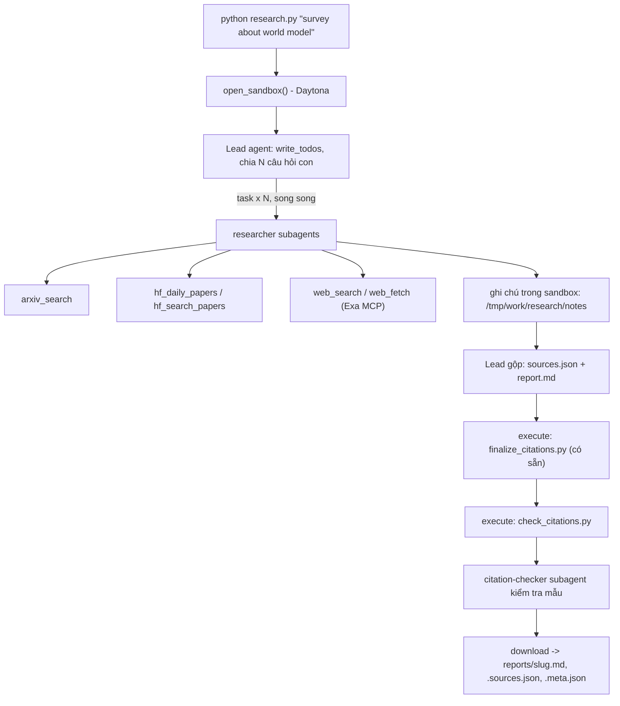

# Deep Research Agent (Deep Agents + Sandbox)

Lab dựng một **hệ thống deep research đa tác tử**: người dùng chỉ cần nhập một chủ đề (ví dụ `survey about world model`), hệ thống tự lập kế hoạch, giao việc cho nhiều subagent, tìm tài liệu trên arXiv, Hugging Face và web, rồi viết một **báo cáo có trích dẫn**.

Hình thức: **bài thực hành cá nhân**. Ngôn ngữ lập trình: Python 3.11 trở lên.

> Tài liệu chi tiết về từng phần: [`GUIDE.md`](GUIDE.md) · Thang điểm: [`RUBRIC.md`](RUBRIC.md) · Mẫu báo cáo: [`REPORT_TEMPLATE.md`](REPORT_TEMPLATE.md)

## 1. Mục tiêu học tập

Sau lab, bạn có thể:

1. Dựng agent bằng thư viện Deep Agents (LangChain): công cụ (tool), system prompt, subagent, backend.
2. Dùng **sandbox** (Daytona) làm không gian làm việc và nơi chạy mã cho agent; hiểu vì sao khóa API và công cụ mạng phải nằm ở phía host chứ không nằm trong sandbox.
3. Viết công cụ gọi API ngoài **chịu được giới hạn tốc độ** (retry, backoff, jitter, `Retry-After`).
4. Thiết kế quy trình đa tác tử: lead chia nhỏ câu hỏi, giao cho N researcher chạy song song, tổng hợp và kiểm tra trích dẫn.
5. Tạo báo cáo có thể kiểm chứng: mọi khẳng định có `[n]` trỏ tới một nguồn có thật.

## 2. Hệ thống làm gì



Nguồn dữ liệu:

| Nguồn | Dùng để |
|---|---|
| arXiv API `https://export.arxiv.org/api/query` | Tìm bài theo từ khóa, sắp theo ngày |
| Hugging Face Daily Papers `/api/daily_papers` | Bài đang "trending": upvotes, githubRepo, summary |
| Hugging Face papers search `/api/papers/search?q=` | Tìm bài theo chủ đề |
| Web qua Exa MCP (`web_search_exa`, `web_fetch_exa`) | Blog, survey, trang dự án, nội dung đầy đủ của một URL |

## 3. Cấu trúc thư mục

```
Lab/
├── README.md  GUIDE.md  RUBRIC.md  REPORT_TEMPLATE.md   tài liệu
├── topics.md                 5 chủ đề cần chạy
├── requirements.txt  .env.example  .gitignore
├── model.py                  CÓ SẴN - không sửa: tạo mô hình LLM từ biến môi trường
├── sandbox.py                CÓ SẴN - không sửa: sandbox Daytona (hoặc Docker), upload, download
├── self_check.py             CÓ SẴN - không sửa: tự kiểm tra trước khi nộp (python self_check.py)
├── finalize_citations.py     CÓ SẴN - không sửa: script chạy trong sandbox, tự sinh `## References` và đánh số lại trích dẫn
├── tools.py                  SINH VIÊN CÀI ĐẶT: retry + 5 công cụ nguồn dữ liệu
├── agents.py                 SINH VIÊN CÀI ĐẶT: prompt, subagent, lead agent
├── research.py               SINH VIÊN CÀI ĐẶT: script chính
├── check_citations.py        SINH VIÊN CÀI ĐẶT: kiểm tra trích dẫn, chạy TRONG sandbox
├── tests/                    unit test offline (không cần mạng, không cần khóa)
└── reports/                  báo cáo sinh ra (đã commit vào repo nộp)
```

Mỗi tệp "SINH VIÊN CÀI ĐẶT" là **pseudo-code chạy được** (import được): các hàm có docstring mô tả việc cần làm, các `TODO n` đánh số theo `GUIDE.md`.

## 4. Cài đặt

```bash
python3 -m venv .venv && source .venv/bin/activate      # Python 3.11+
pip install -r requirements.txt
cp .env.example .env                                     # rồi điền khóa CỦA BẠN
```

Bạn cần ba loại khóa (điền vào `.env`, **không bao giờ commit** `.env`):

| Khóa | Lấy ở đâu | Ghi chú |
|---|---|---|
| LLM (`LAB_MODEL` + khóa nhà cung cấp) | Nhà cung cấp bạn chọn (OpenAI, Anthropic, Google, OpenRouter, Ollama...) | Mô hình **phải hỗ trợ tool calling**. Chép tên mô hình từ tài liệu của nhà cung cấp. |
| `DAYTONA_API_KEY` | https://app.daytona.io | Kiểm tra gói miễn phí / credit hiện hành. Không có tài khoản hoặc hết credit: đặt `SANDBOX=docker` để chạy sandbox trong container Docker cục bộ (xem `.env.example`). |
| `EXA_API_KEY` (khuyến nghị) | https://dashboard.exa.ai/api-keys | Có thể chạy không khóa, nhưng bản miễn phí của MCP bị giới hạn tốc độ rất nhanh. |

### 4.1 Cấu hình `.env` (hai cách)

`.env.example` mở đầu bằng cách 1 (đặt `LAB_MODEL=openai:<model name>` và `OPENAI_API_KEY=...`). Nếu bạn dùng một endpoint **tương thích OpenAI** (W&B Inference, OpenRouter, Together, Groq, Azure gateway, Ollama/vLLM cục bộ...) thì dùng cách 2:

```dotenv
LAB_BASE_URL=https://<endpoint>/v1
LAB_MODEL=<model name>          # phải hỗ trợ tool calling
LAB_API_KEY=<key>               # để trống nếu server cục bộ không cần khóa
SANDBOX=daytona                 # hoặc docker khi không có Daytona
DAYTONA_API_KEY=<key>
EXA_API_KEY=                    # khuyến nghị: để trống sẽ dùng bản miễn phí bị giới hạn
```

`model.py` chọn cách 2 khi `LAB_BASE_URL` (hoặc `OPENAI_ENDPOINT`) có giá trị; nếu không nó dùng `init_chat_model(LAB_MODEL)`. Một số mô hình reasoning từ chối `temperature` khác mặc định: chỉ đặt `LAB_TEMPERATURE` khi bạn biết mô hình chấp nhận.

### 4.2 Biến môi trường tùy chọn

| Biến | Mặc định | Tác dụng |
|---|---|---|
| `LAB_TEMPERATURE` | không gửi | Chỉ đặt khi nhà cung cấp chấp nhận giá trị này. |
| `SANDBOX` | `daytona` | `docker` để chạy sandbox trong container cục bộ (`--network none`). |
| `SANDBOX_IMAGE` | `python:3.12-slim` | Image cho sandbox Docker (phải có `python3` và `bash`). |
| `LANGSMITH_*` | tắt | Bật tracing của LangSmith để xem agent gọi công cụ/lệnh shell nào. |

## 5. Làm bài

Làm theo thứ tự (chi tiết trong `GUIDE.md`):

1. `check_citations.py`: khởi động nhẹ, thuần Python.
2. `tools.py`: viết `with_retry` và 5 công cụ. Thử riêng từng công cụ: `python tools.py`.
3. `agents.py`: viết prompt, subagent và lead agent.
4. `research.py`: ghép tất cả; chạy một chủ đề:

```bash
python research.py "survey about world model"
```

Kết quả nằm ở `reports/survey-about-world-model.md` cùng `.sources.json` và `.meta.json`.

Dùng `python -u` để thấy tiến độ ngay (mặc định Python đệm stdout khi ghi ra tệp):

```bash
python -u research.py "survey about world model"
```

Trong lúc chạy, log cho biết lead đã gọi công cụ nào, kế hoạch `write_todos` hoàn thành bao nhiêu bước, và tổng thời gian. Retry/backoff in ra stderr (kèm `Retry-After` và lý do nguồn từ chối).

## 6. Chạy và kiểm tra kết quả

### 6.1 Test offline trước (không cần mạng, không cần khóa, không tốn token)

```bash
python -m unittest discover -s tests -v      # toàn bộ unit test
python -m pytest tests -q                    # nếu bạn thích pytest (pip install pytest)
python tools.py                              # gọi thật 5 công cụ nguồn dữ liệu
```

`tests/` chỉ dùng thư viện chuẩn (`unittest`) và chạy được trên Python 3.11+ **không cần** cài `langchain`, `deepagents` hay `daytona`: các phụ thuộc ngoài được thay bằng stub trong `tests/stubs.py`. Bộ test phủ `with_retry` (backoff/jitter/`Retry-After`/cap/lần thử cuối), làm sạch truy vấn arXiv và parse Atom, ánh xạ bản ghi Hugging Face, SSE + cờ giới hạn tốc độ của Exa, che khóa API, `slugify`, 6 quy tắc của `check_citations.check`, và hợp đồng `finalize_citations.py` ↔ validator.

### 6.2 Chạy 5 chủ đề

`topics.md` liệt kê 5 chủ đề; chạy mỗi chủ đề một lần (tuần tự, không song song: arXiv và Exa giới hạn theo IP):

```bash
python research.py "survey about world model"
python research.py "survey about reinforcement learning for LLM reasoning"
python research.py "survey about LLM agents and tool use"
python research.py "survey about video and multimodal generation"
python research.py "survey about efficient inference and small language models"
```

Mỗi lần chạy mở một sandbox mới, chạy lead agent + các researcher song song, rồi **luôn** dừng và xóa sandbox (kể cả khi lỗi). Lần chạy hỏng **thoát mã 1 và không ghi gì cả** — không để lại báo cáo rỗng trông như thành công.

### 6.3 Kiểm tra trích dẫn và tự kiểm tra

```bash
python3 check_citations.py reports/<slug>.md reports/<slug>.sources.json   # phải in OK
python self_check.py                                                      # kiểm tra phần tự động của RUBRIC
```

`self_check.py` (không tốn token) kiểm tra: đủ 5 báo cáo, `meta.json` có `subagent_calls >= 3` và `>= 3` họ nguồn, trích dẫn qua `check_citations.check`, và không có `.env`/khóa trong git. Thêm `--no-git` để bỏ phần git.

## 7. Đọc `reports/`

Mỗi chủ đề sinh ra **ba tệp**, tên lấy từ chủ đề đã `slugify` (chữ thường, gạch nối, tối đa 60 ký tự):

| Tệp | Nội dung |
|---|---|
| `<slug>.md` | Báo cáo: `# Title`, `## TL;DR`, `## Background`, 3-6 phần theo chủ đề, `## Trends and open problems`, `## References`. **Đúng bản đã tải về từ sandbox** (phần tham khảo do `finalize_citations.py` sinh trong sandbox). |
| `<slug>.sources.json` | Mảng nguồn đã được chuẩn hoá: `{"n", "id", "url", "title", "date", "source"}` với `source` ∈ `arxiv`, `hf-daily`, `hf-search`, `web`. |
| `<slug>.meta.json` | Bằng chứng chấm điểm: `topic`, `model`, `elapsed_s`, `subagent_calls` (số lần lead gọi công cụ `task`), `tool_calls`, `tokens`, `n_sources`, `source_families`. |

`meta.json` là thứ `self_check.py` và người chấm đọc trước: hãy xem `subagent_calls` (cần `>= 3`) và `source_families` (cần `>= 3` trong 4 họ). `tokens` **chỉ** đếm tin nhắn của lead, chưa gồm subagent, nên chi phí thật cao hơn.

Trích dẫn trong `<slug>.md`: mỗi khẳng định không hiển nhiên có `[n]`; mọi `[n]` có trong `sources.json`; mọi nguồn được trích dẫn ít nhất một lần; `## References` có **đúng một dòng cho mỗi nguồn**, mỗi dòng **đúng một URL** khớp `sources.json`.

## 8. Thời gian, chi phí và an toàn

- Dùng một mô hình **rẻ nhưng hỗ trợ tool calling**, và **đặt giới hạn** (số lần gọi mô hình/công cụ cho lead và subagent, `recursion_limit`): một prompt hỏng có thể khiến agent lặp rất lâu. Đây là hạng mục 2.5 của `RUBRIC.md`. Giới hạn hiện tại nằm ở `agents.py` (`LEAD_LIMITS`, `SUB_LIMITS`, `RECURSION_LIMIT`).
- Kết quả có tính ngẫu nhiên: cùng một mã có thể cho báo cáo hợp lệ ở lần này và trích dẫn lỗi ở lần sau. Hãy sửa **prompt và mã**, không sửa tay báo cáo.
- Mỗi lần chạy tốn token LLM và thời gian sandbox. `open_sandbox()` luôn dừng và xóa sandbox khi kết thúc, kể cả khi lỗi. Đừng bỏ qua nó.
- **Không đưa bí mật vào sandbox.** Sandbox không ngăn được prompt injection hay việc đẩy dữ liệu ra mạng; một trang web độc hại có thể khiến agent chạy lệnh bên trong sandbox. Vì vậy mọi công cụ gọi mạng và mọi khóa ở lại phía host.
- Nội dung lấy từ web là **dữ liệu không đáng tin**: agent không được làm theo chỉ dẫn nằm trong đó.
- arXiv và Exa giới hạn theo IP: chạy lệch giờ với bạn cùng lớp. Lỗi `HTTP 429` (kể cả khi Exa trả HTTP 200 kèm cờ giới hạn) đã được retry; nếu vẫn thiếu một họ nguồn, prompt của lead yêu cầu bù bằng họ khác để đủ 3 họ.
